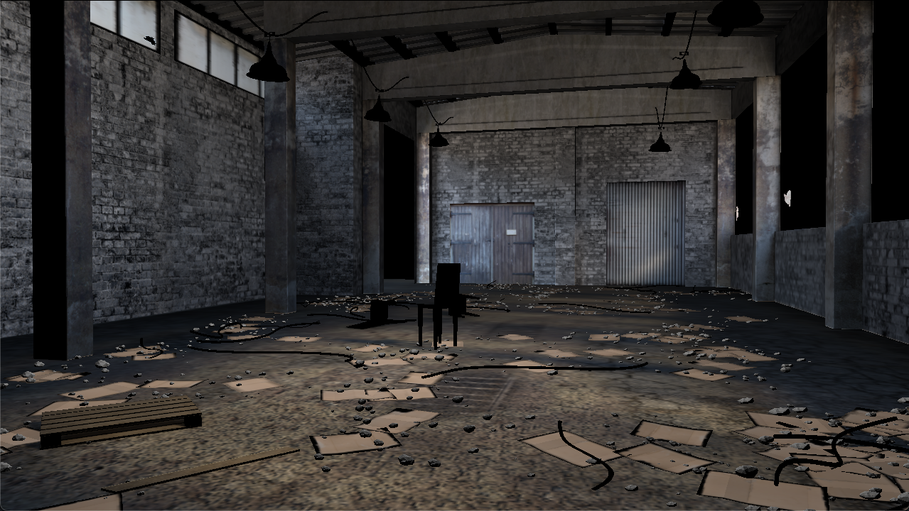
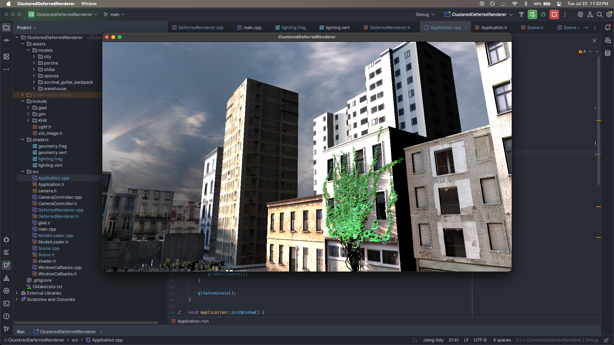

# Clustered Deferred Renderer

A modern C++ OpenGL clustered deferred renderer. This project renders scenes with many dynamic lights by assigning lights to 3D clusters entirely in the fragment shader.

## ✨ Features

- Clustered light culling in fragment shader (no compute shaders)
- Deferred rendering with:
  - Geometry pass (G-buffer)
  - Lighting pass using clustered light assignment
- glTF 2.0 model loading (via `cgltf`)
- Custom camera and input controller
- Basic Blinn-Phong lighting
- Optional normal/specular/emissive/occlusion texture support

## 📸 Screenshots





## 🧠 How It Works

- **G-buffer** stores position, normal, and albedo/specular info per fragment.
- **Cluster division**: 3D frustum is split into X × Y × Z clusters.
- **Light culling**: Each light’s bounding sphere is tested against cluster AABBs in the fragment shader.
- **Lighting**: Each fragment fetches relevant lights for its cluster and computes lighting (Blinn-Phong).


## 🎮 Controls

| Input         | Action         |
|---------------|----------------|
| W / A / S / D | Move camera    |
| Space         | Move up        |
| Shift         | Move down      |
| Mouse Move    | Look around    |
| Scroll        | Zoom in/out    |
| ESC           | Quit program   |

## 📁 Project Structure

```
ClusteredDeferredRenderer/
├── assets/
│   ├── images/             # images
│   └── models/             # glTF models
├── include/
│   ├── glad/
│   ├── glm/
│   ├── KHR/
│   ├── cgltf.h             # glTF loader
│   └── stb_image.h         # Image loader
├── shaders/                # GLSL shader programs
│   ├── geometry.vert
│   ├── geometry.frag
│   ├── lighting.vert
│   └── lighting.frag
├── src/
│   ├── Application.{cpp,h}
│   ├── CameraController.{cpp,h}
│   ├── camera.h
│   ├── DeferredRenderer.{cpp,h}
│   ├── ModelLoader.{cpp,h}
│   ├── Scene.{cpp,h}
│   ├── shader.h
│   ├── WindowCallbacks.{cpp,h}
│   ├── glad.c
│   └── main.cpp
├── .gitignore
└── CMakeLists.txt
```

## 🛠️ Build Instructions

### Dependencies

- OpenGL 3.3+
- CMake
- GLFW
- GLAD
- GLM

### Build (macOS/Linux/Windows)

```bash
git clone https://github.com/Lucas-Wng/ClusteredDeferredRenderer.git
cd ClusteredDeferredRenderer
mkdir build && cd build
cmake ..
make
./ClusteredDeferredRenderer
```

Make sure you have `stb_image.h` and `cgltf.h` in your `include/` directory as shown.
